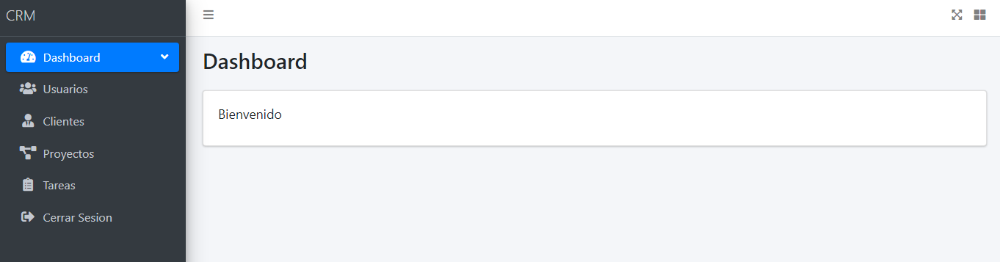
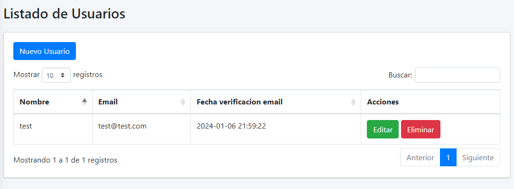
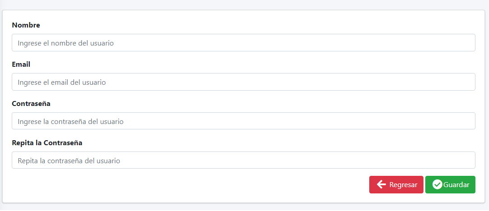
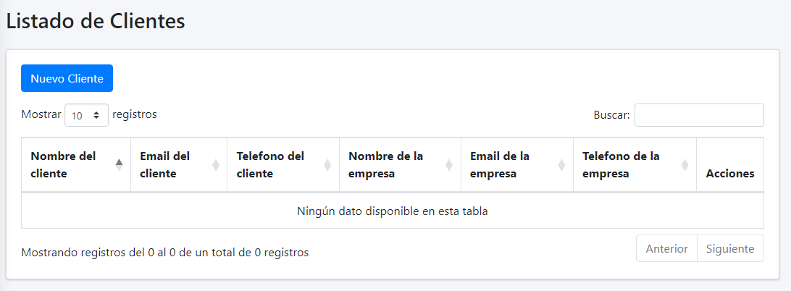
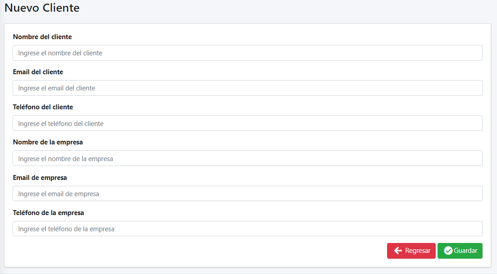
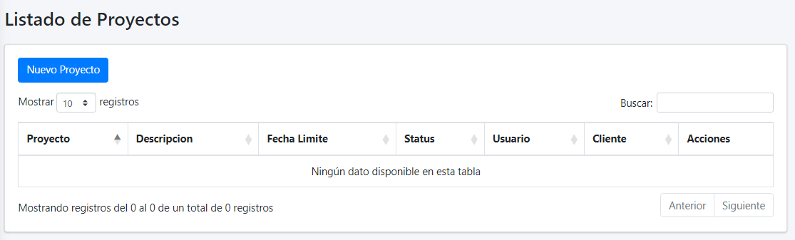
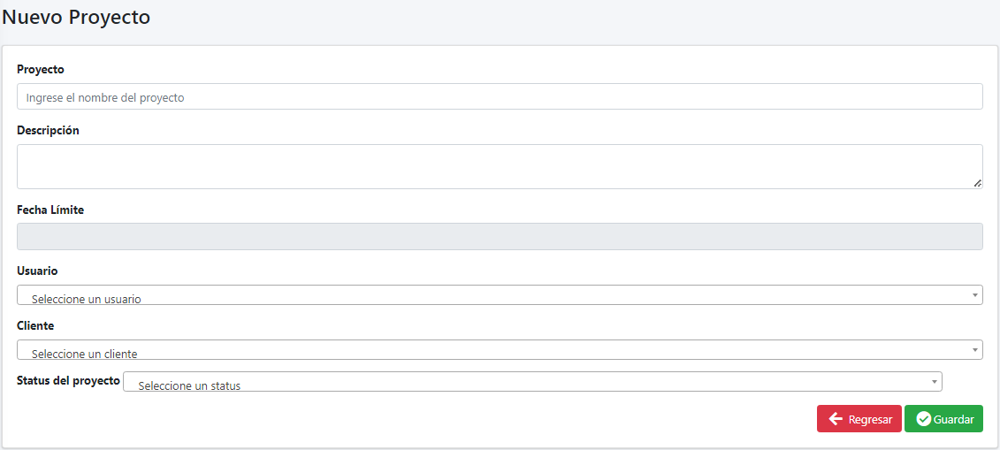
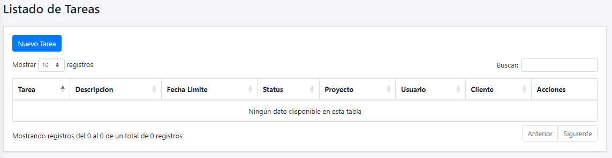
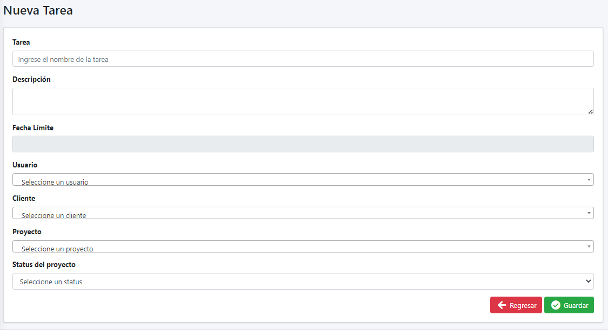

# Laravel CRM

Este proyecto es un sistema CRM desarrollado en Laravel, diseñado para gestionar de manera eficiente la relación con los clientes, así como la planificación y seguimiento de tareas y proyectos. La aplicación utiliza el patrón de diseño Modelo-Vista-Controlador (MVC) de Laravel y ofrece una estructura modular para facilitar su expansión y personalización.

## Pre-Requisitos

- Sistema operativo Window 10
- Postman for Windows Version 10.21.11
- Xampp Version 3.3.0
- MySQL Version 8.0.2
- Laravel Framework 9.52.16
- Visual Studio Code
- Composer version 2.4.4
- NodeJs version 18.12.1

## Instalación

Clonar repositorio 
```bash
git clone https://github.com/WillianAbrego/LaravelCRM.git
```
Ingresar al folder
```bash
cd LaravelCRM
```
Abrir con visual studio code
```bash
code .
```

Actualizar composer 
```bash
composer install or composer update
```
Copiar archivo .env.example y renombrarlo como .env
```bash
cp .env.example .env
```

Configurar base de datos en archivo .env
 ```
 DB_CONNECTION=mysql
DB_HOST=127.0.0.1
DB_PORT=3306
DB_DATABASE={name_db}
DB_USERNAME={user_db}
DB_PASSWORD={pass_db}
 ```
```bash
php artisan key:generate
```
***
Reiniciar la base de datos de la aplicación Laravel
```bash
php artisan migrate:fresh --seed
```
## Nota:
Asegúrate de haber definido las migraciones y semillas necesarias antes de ejecutar este comando. Además, ten en cuenta que este comando eliminará todos los datos actuales de la base de datos.

***

Ejecutar el siguiente comando que se utiliza para instalar las dependencias especificadas en el archivo package.json

```bash
npm install
```

En una consola ejecutar el siguiente comando
```bash
npm run dev
```

Sin cerrar la consola donde se ejecuto el comando anterior abrir una nueva consola para poder iniciar el servidor de desarrollo integrado de Laravel

```bash
 php artisan serve
```
Una vez ejecutado, puedes acceder a tu aplicación en el navegador a través de la URL http://localhost:8000.
***

## Instrucciones para Pruebas

Posteriormente ingresar a http://127.0.0.1:8000/login e ingresar las credenciales que se crearon cuando ejecuto la migracion. 

- email => test@test.com
- password => 12341234

## Dashboard



## Vista para usuario y creación de usuario 

| vista  | creación  |   
|---|---|
|  | | 

## Vista para cliente y creación de cliente 

| vista  | creación  |   
|---|---|
|  | |   
 
## Vista para proyectos y creación de proyectos 

| vista  | creación  |   
|---|---|
|  | |   

## Vista para tareas y creación de tareas

| vista  | creación  |   
|---|---|
|  | |   


